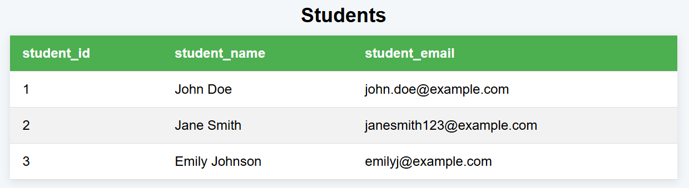
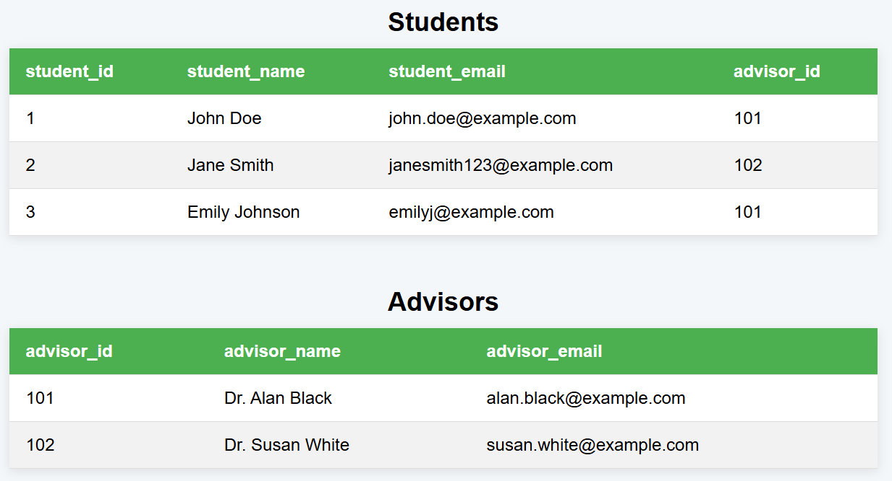

# Relational Database Management Systems (RDBMS)

Relational database management systems are a popular method of storing large quantities of data. They provide query mechanisms that allow for quick and efficient selecting, inserting, updating, and deleting of data. Furthermore, they allow for simple yet intricate relationships between classes of data, known as tables.

## Fundamentals

Relational database management systems store data in tables consisting of rows and columns. Rows are also known as records or tuples; columns are also known as attributes. A table represents a data class, where the rows are instances of that class and the columns define the data that the instance can store.

For example, we could have a table called `Students` with three columns: `student_id`, `student_name`, and `student_email`. Each row of the table would store a student's ID, name, and email.

## Keys

Keys are used to establish relationships between tables. The two most important types of keys are primary keys and foreign keys. Each table should have a primary key column that's unique for each row. In our `Students` table, this primary key would be `student_id`.

Let's suppose we have another table called `Advisors` with three columns: `advisor_id`, `advisor_name`, and `advisor_email`. Each row of the table would store an advisor's ID, name, and email. The primary key of the table `advisor_id`

Each student has an advisor. We can establish this relationship by adding an `advisor_id` column to the `Students` table so each student stores the ID of their advisor. `advisor_id` in the `Students` table would be known as a foreign key. Unlike primary keys, tables can have as many foreign keys as they want. 

## Relationships

There are multiple types of relationships we can have between tables. These are: one-to-one, one-to-many, and many-to-many.

One-to-one:
every store has one manager, and every manager has one store.

One-to-many:
every employee has one store, and every store has many employees.

Many-to-many:
every store has many products, and every product has many stores.

The `students` and `advisors` tables from earlier was an example of a one-to-many relationship. Every student has one advisor but every advisor has many students.

## SQL
Structured Query Language (SQL) is a language designed to query relational databases. The vast majority of RDBMS support SQL. SQL can be used to create tables and insert, update, delete, and select data.
