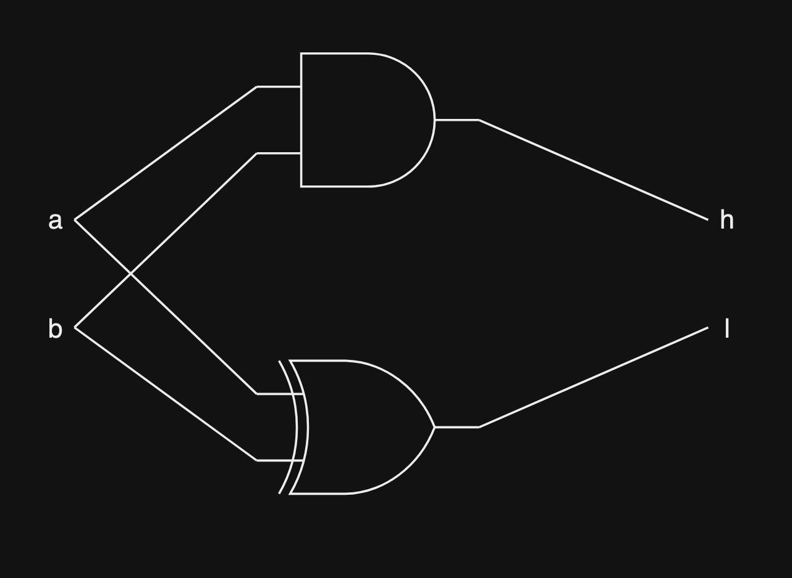
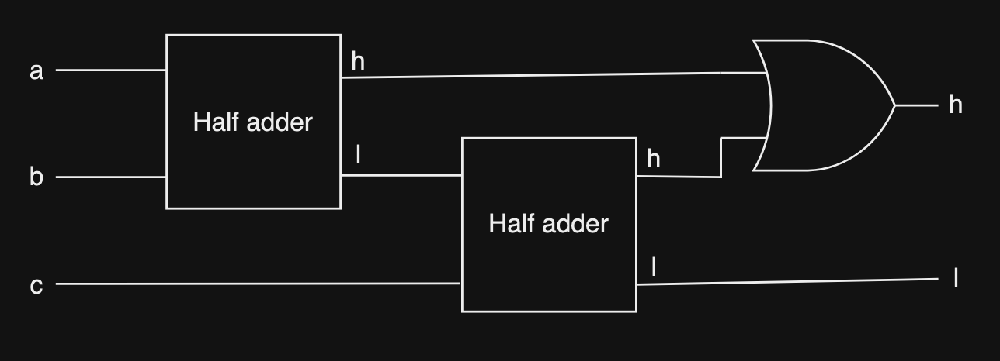
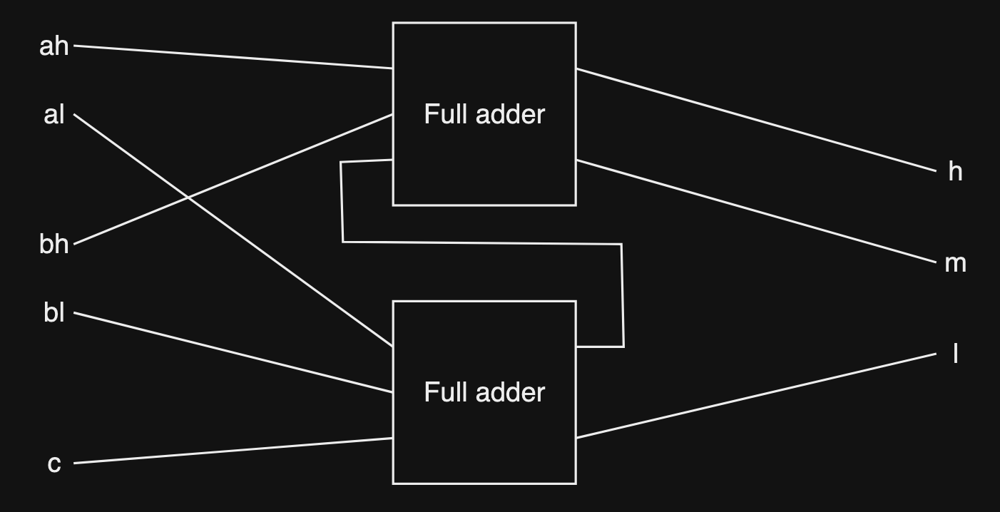
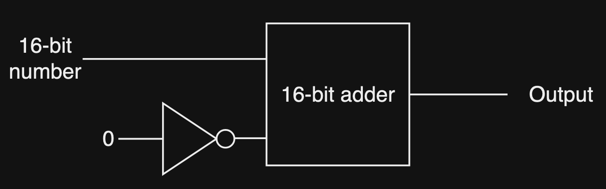
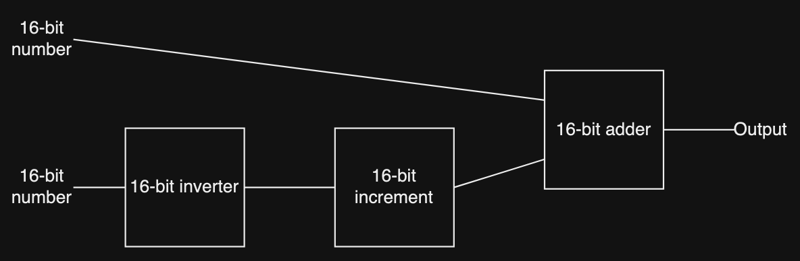

# Arithmetic digital circuits

Everything that a computer can do can be boiled down to mathematics and arithmetics. So being able to do arithmetics with digital circuits will be the next big step we're going to take.

We'll be building some digital circuits capable of addition and subtraction

___

# Half adder

## Description

This circuit will take in 2 input bits, add them together and output 2 bits.

This circuit will be the foundation for other arithmetic circuits

## Truth table

> Note: h is the high bit, l is the low bit

| a | b | h | l |
| - | - | - | - |
| 0 | 0 | 0 | 0 |
| 0 | 1 | 0 | 1 |
| 1 | 0 | 0 | 1 |
| 1 | 1 | 1 | 0 |

## Structure

This can be created using an AND gate and an XOR gate:

___

# Full adder

## Description

This circuit works the same way as the half adder circuit, but it will take 3 input bits instead of 2 input bits.

## Truth table

| a | b | c | h | l |
| - | - | - | - | - |
| 0 | 0 | 0 | 0 | 0 |
| 0 | 0 | 1 | 0 | 1 |
| 0 | 1 | 0 | 0 | 1 |
| 0 | 1 | 1 | 1 | 0 |
| 1 | 0 | 0 | 0 | 1 |
| 1 | 0 | 1 | 1 | 0 |
| 1 | 1 | 0 | 1 | 0 |
| 1 | 1 | 1 | 1 | 1 |

## Structure

This can be constructed by connecting 2 half adders together

___

# Multi-bit adder

## Description

This circuit functions similarly to how we would do binary addition. It takes in 5 bits (2 2-bit numbers and 1 carry bit), add them together and output a 3-bit number.

Input:
- *ah* *al* is a 2-bit number
- *bh* *bl* is a 2-bit number
- *c* is a carry bit

Output:
- *h* is the high bit
- *m* is the middle bit
- *l* is the low bit

## Truth table

The truth table is very big so I'll just put an example:

| ah | al | bh | bl | c | h | m | l |
| -- | -- | -- | -- | - | - | - | - |
| 1 | 0 | 1 | 0 | 1 | 1 | 0 | 1 |

ah = 1 and al = 0 (Number is 2 in binary)

ah = 1 and al = 0 (Number is 2 in binary)

c = 1 (1 carry bit)

h = 1, m = 0, l = 1 (101 in binary, 5 in decimal)

so 2 + 2 + 1 = 5

## Structure

This circuit can be created using 2 full adders. 1 adder's high bit will carry over to the input of the other adder, this mimics how we carry bits when we manually add binary numbers.

> We can keep adding onto this and create adders that can handle more bits like a 16-bit or 32-bit adder

___

# Increment

## Description

It's quite useful to have a circuit that can count up 1 by 1 in computer science and programming. So let's learn about the increment circuit.

This circuit will take in a number and increment it by 1. For this, we will use 16-bit number since it's quite useful to have something that can add multi-bit number.

## Structure

___

# Subtraction

## Description

A big part of mathematics is subtraction. So let's learn about a circuit that allows us to subtract a number from another. We'll use 16-bit number because that allows us to subtract bigger number.

## Truth table

Here's an example truth table for how the circuit should function:

| input 1 | input 2 | output |
| --- | --- | --- |
| A | 9 | 1 |
| 8FFF | 7FFF | 1000 |

> Note: The number uses 2's complement, meaning the most significant bit will be the sign bit. If the sign bit is 1 then the number is negative

## Structure

What we need to do when we subtract is to flip the 2nd number to its negative counterpart and add it to the 1st number. 

There's a slight problem, which is when we flip a number from positive to negative in binary, for example, we want to change a 16-bit 1 to a 16-bit -1, if we just use a 16-bit inverter, we just changed the number to a 16-bit -2 instead. So what we need to do is to add 1 into the inverted number with the increment circuit we created before.

> Note: A 16-bit inverter will just flip all the bits in a 16-bit number. It will change 1 to 0 and vice versa

