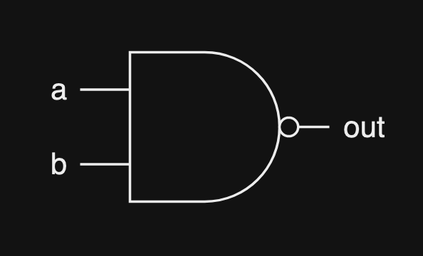
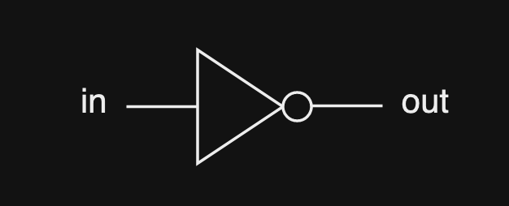
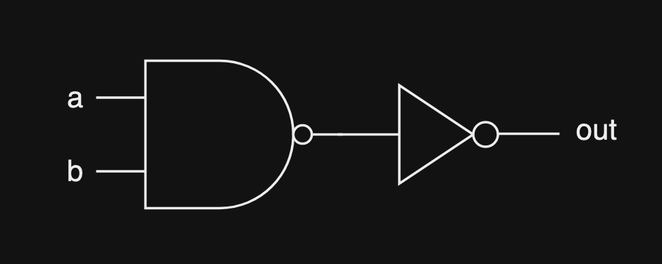
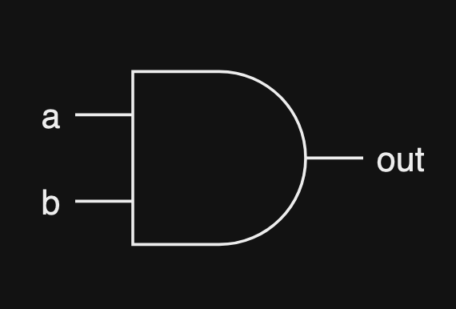
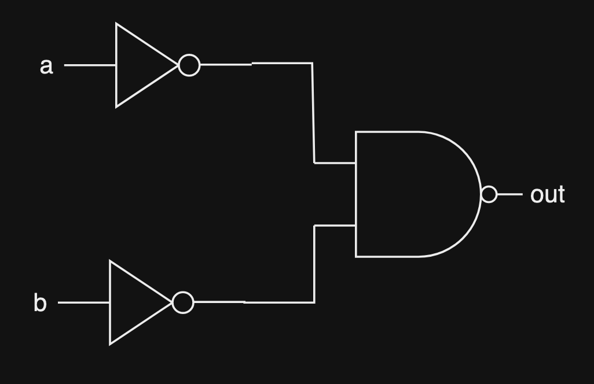
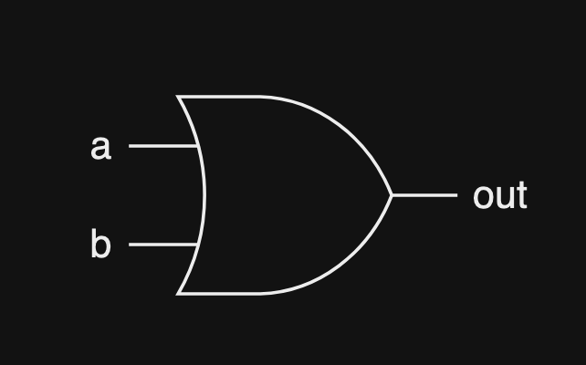
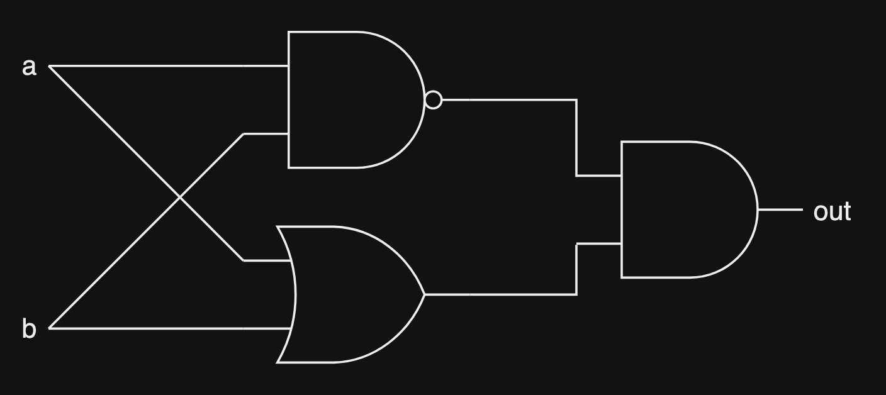
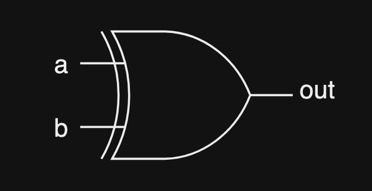

# Basic logic gates

The logic gates are the building blocks for digital circuits. They represent Boolean logical operations. Let's learn about some of them.

___

# NAND gates

## Description

This is the most fundamental logic gate. In fact, you can build an entire computer using just NAND gates. This gate only produces an output of 0 if all of its input is 1.

This can be made using just 2 switches.

## Truth table

| a | b | out |
| - | - | --- |
| 0 | 0 | 1 |
| 0 | 1 | 1 |
| 1 | 0 | 1 |
| 1 | 1 | 0 |

## Symbol

___

# NOT gate

## Description 

The NOT gate, also known as the inverter gate, takes in 1 input and output 1 output. This circuit will invert the input, so if the input is 1 then the output will be 0 and vice versa.

## Truth table

| in | out |
| -- | --- |
| 0 | 1 |
| 1 | 0 |

## Structure

This gate can be created using 1 NAND gate:

## Symbol

___

# AND gate

## Description

This gate will take in 2 or more input and only output a 1 if all inputs are 1.

## Truth table

| a | b | out |
| - | - | --- |
| 0 | 0 | 0 |
| 0 | 1 | 0 |
| 1 | 0 | 0 |
| 1 | 1 | 1 |

## Structure

This gate can be created using a NAND gate and a NOT gate because it's basically the opposite of a NAND gate:

## Symbol 

___

# OR gate

## Description

This gate will take in 2 or more input and only output a 0 if all inputs are 0.

## Truth table

| a | b | out |
| - | - | --- | 
| 0 | 0 | 0 |
| 0 | 1 | 1 |
| 1 | 0 | 1 |
| 1 | 1 | 1 |

## Struture

This gate can be created using a NAND gate and 2 NOT gate because so as to flip the 2 inputs:

## Symbol

___

# XOR (Exclusive OR) gate

## Description

This gate takes in 2 or more input and will only output a 1 if there's an odd number of 1s in the inputs. So this gate is quite useful if you want to differentiate between odd and even number of bits.

## Truth table

| a | b | out |
| - | - | --- |
| 0 | 0 | 0 |
| 0 | 1 | 1 |
| 1 | 0 | 1 |
| 1 | 1 | 0 |

## Structure

This gate can be created using 1 NAND gate, 1 OR gate and 1 AND gate:

## Symbol

