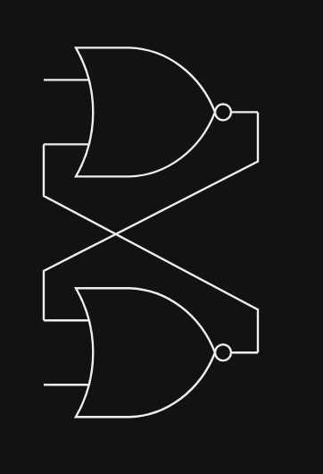
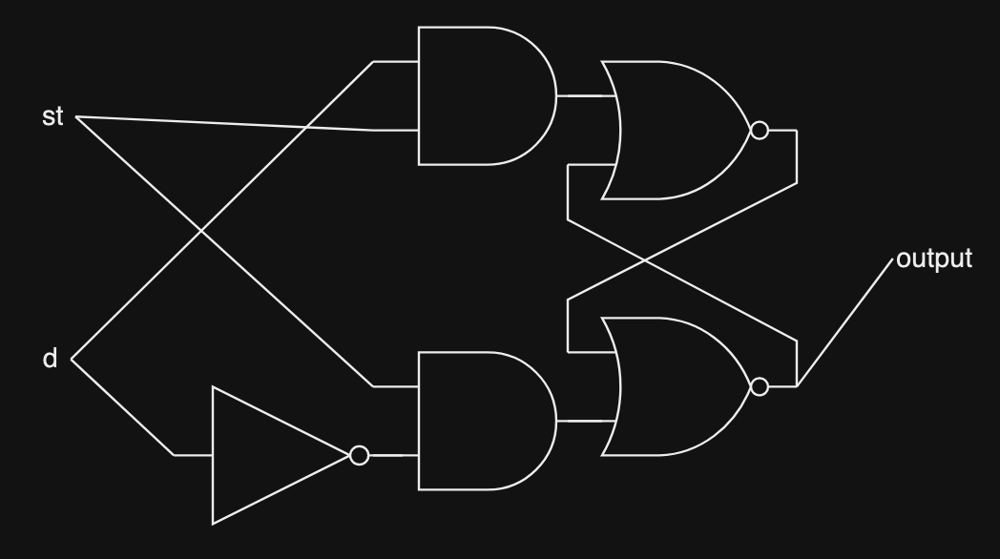
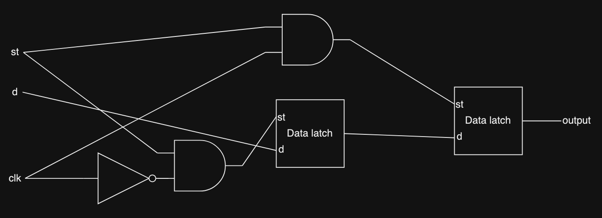
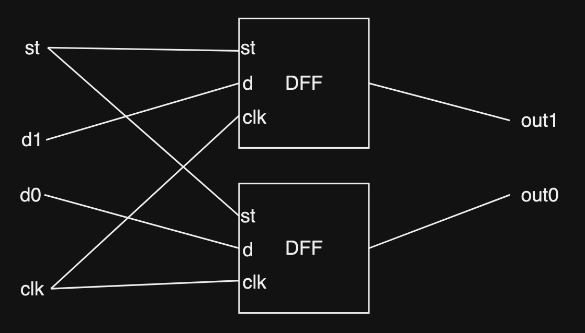
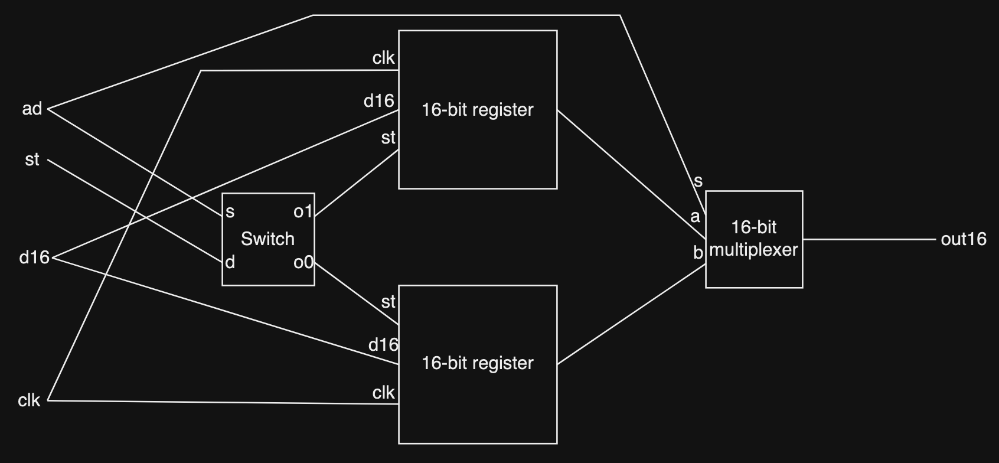

# Memory circuits

A very useful function of a computer is its ability to "remember" information, which is why memory circuits are very important. It is extremely useful to be able to hold data inputed into a circuit, so let's learn about some memory circuits

___

# Data latch

## Description

A data latch is capable of outputing and storing a single bit. It takes in 1 input bit as data and 1 input bit as a store signal. A store signal is used to indicate whether the circuit should store the input data or not. When the store signal is 1, the value of data is outputed and stored. When the store signal is 0, the value of data is ignored and the previously stored value is outputed

## Truth table

> Note: st is the store signal, d is the input data bit

| st | d | Effect |
| -- | - | ------ |
| 1 | 0 | output set to 0 |
| 1 | 1 | output set to 1 |
| 0 | 1 | output set to previously stored value |
| 0 | 0 | output set to previously stored value |

## Structure

This circuit can be created using 2 AND gates, 2 NOR (inverted OR) gates and 1 NOT gate. 

A useful concept to remember is that when you connect the output of 2 NOR gates to the inputs of each other, you create a latch circuit. This circuit will hold on to its previous state, what we need to do is to lock the input to the NOR latch circuit if st is not set. we can do this using AND gates

A NOR latch has this structure:

Data latch structure:

___

# Data Flip-Flop (DFF)

## Description

This circuit is similar to the data latch, it is capable of storing and outputing 1 bit of information, but this circuit's output only change when a clock signal input goes HIGH (change from 0 to 1). This event is called a clock tick.

> A clock will continously go HIGH (0 to 1) and LOW (1 to 0). This helps with timing in a computer.

If the store signal is 1 at the time of the clock tick. the input data bit will become the new output and gets stored into the circuit. Otherwise, the output doesn't change.

## Truth table

| st | d | output at clock tick |
| -- | - | ------ |
| 1 | 0 | 0 |
| 1 | 1 | 1 |
| 0 | 1 | previously stored data |
| 0 | 0 | previously stored data |

## Structure

This circuit will need 2 data latches, 1 for latching the data input and wait for the clock to go HIGH, 1 for storing the actual data. We'll also need 2 AND gates and 1 NOT gate to validate the store signal and check if it's a 1 or 0.

> Note: clk is the clock signal

___

# Register

## Description

The register is a very important component as it is responsible for storing immediate data for quick access. A register can hold multiple bits of data. We'll learn how a 2-bit register works. We can later on expand this 2-bit register work hold more bits using the same technique.

The register functions similarly to the data flip-flop, except it can store multiple bits.

## Structure

This circuit can be created with 2 DFFs. It is quite simple. With this simple structure, we can keep adding onto it and create a register that can store however many bits we want.

___

# RAM

## Description

The RAM (Random Access Memory) is a memory unit with multiple different registers that we can address and use.

For this circuit, we'll build a simple RAM circuit with 2 16-bit registers that we can address using a 1-bit address signal (ad). When ad is 1, the second register will be picked. When ad is 0, the first register will be picked. 

## Structure

This circuit will need 2 16-bit registers, a switch to select which registers to use based on the ad signal, and a 16-bit multiplexer to select which of the 2 registers to output.

> Note: d16 is the 16-bit number to be stored.

