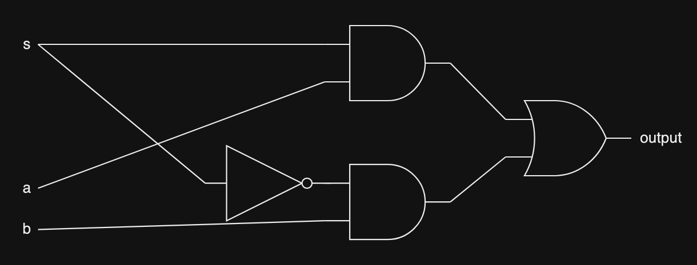
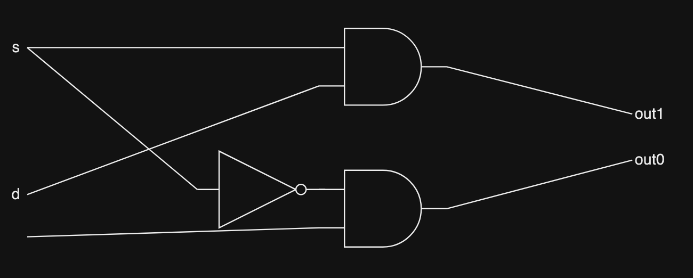

# Switching circuits

It turns out, being able to select which input signals and which output path for our signals to go to is quite useful. So let's explore how to build a digital circuit that allows us to select which input signal and which output path to use.

___

# Multiplexer

## Description

A multiplexer pick between 2 inputs using a select signal. If select is 1, it picks the 2nd input. If select is 0, it picks the 1st input.

## Truth table

> Note: s is the select signal

| s | a | b | output |
| - | - | - | ------ |
| 0 | 0 | 0 | 0 | 
| 0 | 1 | 0 | 0 |
| 0 | 0 | 1 | 1 |
| 0 | 1 | 1 | 1 |
| 1 | 0 | 0 | 0 |
| 1 | 0 | 1 | 0 |
| 1 | 1 | 0 | 1 |
| 1 | 1 | 1 | 1 |

## Structure

___

# Switch

## Description

This circuit will channel input data bit to 1 of 2 output paths. It will take in 2 input signals, 1 select signal and 1 input data signal. It also has 2 output paths for the circuit to select between.

## Truth table

> Note: d is the input data bit

| s | d | out1 | out0 |
| - | - | ---- | ---- |
| 0 | 0 | 0 | 0 |
| 0 | 1 | 0 | 1 |
| 1 | 0 | 0 | 0 |
| 1 | 1 | 1 | 0 |

## Structure

