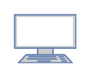

# OSI MODEL
OSI stands for **Open Systems Interconnection**. It has been developed by ISO – ‘**International Organization for Standardization**‘, in the year 1984. It is a 7 layer architecture with each layer having specific functionality to perform. All these 7 layers work collaboratively to transmit the data from one person to another across the globe. 

The Open Systems Interconnection (OSI) model describes seven layers that computer systems use to communicate over a network. It was the first standard model for network communications, adopted by all major computer and telecommunication companies in the early 1980s.

> Prerequisite: [Basics of Computer Networking](https://www.geeksforgeeks.org/basics-computer-networking/)

### **1. Physical Layer (Layer 1) :**

The lowest layer of the OSI reference model is the physical layer. It is responsible for the actual physical connection between the devices. The physical layer contains information in the form of **bits.** It is responsible for transmitting individual bits from one node to the next. When receiving data, this layer will get the signal received and convert it into 0s and 1s and send them to the Data Link layer, which will put the frame back together.  

The functions of the physical layer are as follows:  

1.  **Bit synchronization:** The physical layer provides the synchronization of the bits by providing a clock. This clock controls both sender and receiver thus providing synchronization at bit level.
2.  **Bit rate control:** The Physical layer also defines the transmission rate i.e. the number of bits sent per second.
3.  **Physical topologies:** Physical layer specifies the way in which the different, devices/nodes are arranged in a network i.e. bus, star, or mesh topology.
4.  **Transmission mode:** Physical layer also defines the way in which the data flows between the two connected devices. The various transmission modes possible are Simplex, half-duplex and full-duplex.
Hub, Repeater, Modem, Cables are Physical Layer devices. 
Network Layer, Data Link Layer, and Physical Layer are also known as **Lower Layers** or **Hardware Layers**.

### **2\. Data Link Layer (DLL) (Layer 2) :**

The data link layer is responsible for the node-to-node delivery of the message. The main function of this layer is to make sure data transfer is error-free from one node to another, over the physical layer. When a packet arrives in a network, it is the responsibility of DLL to transmit it to the Host using its MAC address.   
Data Link Layer is divided into two sublayers:  

1.  Logical Link Control (LLC)
2.  Media Access Control (MAC)

The packet received from the Network layer is further divided into frames depending on the frame size of NIC(Network Interface Card). DLL also encapsulates Sender and Receiver’s MAC address in the header. 

The Receiver’s MAC address is obtained by placing an ARP(Address Resolution Protocol) request onto the wire asking “Who has that IP address?” and the destination host will reply with its MAC address.  

The functions of the Data Link layer are :  

1.  **Framing:** Framing is a function of the data link layer. It provides a way for a sender to transmit a set of bits that are meaningful to the receiver. This can be accomplished by attaching special bit patterns to the beginning and end of the frame.
2.  **Physical addressing:** After creating frames, the Data link layer adds physical addresses (MAC address) of the sender and/or receiver in the header of each frame.
3.  **Error control:** Data link layer provides the mechanism of error control in which it detects and retransmits damaged or lost frames.
4.  **Flow Control:** The data rate must be constant on both sides else the data may get corrupted thus, flow control coordinates the amount of data that can be sent before receiving acknowledgement.
5.  **Access control:** When a single communication channel is shared by multiple devices, the MAC sub-layer of the data link layer helps to determine which device has control over the channel at a given time.

Packet in Data Link layer is referred to as **Frame.**
Data Link layer is handled by the NIC (Network Interface Card) and device drivers of host machines. 
Switch & Bridge are Data Link Layer devices.

### **3\. Network Layer (Layer 3) :**

The network layer works for the transmission of data from one host to the other located in different networks. It also takes care of packet routing i.e. selection of the shortest path to transmit the packet, from the number of routes available. The sender & receiver’s IP addresses are placed in the header by the network layer. 

The functions of the Network layer are :  

1.  **Routing:** The network layer protocols determine which route is suitable from source to destination. This function of the network layer is known as routing.
2.  **Logical Addressing:** In order to identify each device on internetwork uniquely, the network layer defines an addressing scheme. The sender & receiver’s IP addresses are placed in the header by the network layer. Such an address distinguishes each device uniquely and universally.

Segment in Network layer is referred to as **Packet**. 

Network layer is implemented by networking devices such as routers.  

**Network layer protocols**

**1. IP: Internet Protocol (IPv4)**
IPv4 is a network layer protocol that contains addressing and control information, which helps packets be routed in a network. IP works in tandem with TCP 
to deliver data packets across the network. Under IP, each host is assigned a 32-bit address comprised of two major parts: the network number and host 
number. The network number identifies a network and is assigned by the internet, while the host number identifies a host on the network and is assigned by 
a network admin. The IP is only responsible for delivering the packets, and TCP helps puts them back in the right order.

**Advantages**

IPv4 encrypts data to ensure privacy and security.
With IP, routing data becomes more scalable and economical.

**Disadvantages**

IPv4 is labor intensive, complex, and prone to errors.

**2. IPv6: Internet Protocol version 6**
IPv6 is the latest version of the Internet Protocol, a network layer protocol that possesses addressing and control information for enabling packets to be 
routed in the network. IPv6 was created to deal with IPv4 exhaustion. It increases the IP address size from 32 bits to 128 bits to support more levels of 
addressing.

**Advantages**

More efficient routing and packet processing compared to IPv4.
Better security compared to IPv4.

**Disadvantages**

IPv6 is not compatible with machines that run on IPv4.
Challenge in upgrading the devices to IPv6.

**3. ICMP: Internet Control Message Protocol**
ICMP is a network layer supporting protocol used by network devices to send error messages and operational information. ICMP messages delivered in IP 
packets are used for out-of-band messages related to network operation or misoperation. ICMP is used to announce network errors, congestion, and timeouts, 
as well assist in troubleshooting.

**Advantages**

ICMP is used to diagnose network issues.

**Disadvantages**

Sending a lot of ICMP messages increases network traffic.
End users are affected if malicious users send many ICMP destination unreachable packets.

### **4\. Transport Layer (Layer 4) :**

The transport layer provides services to the application layer and takes services from the network layer. The data in the transport layer is referred to as _Segments_. It is responsible for the End to End Delivery of the complete message. The transport layer also provides the acknowledgement of the successful data transmission and re-transmits the data if an error is found.

**At sender’s side:** Transport layer receives the formatted data from the upper layers, performs **Segmentation**, and also implements **Flow & Error control** to ensure proper data transmission. It also adds Source and Destination port numbers in its header and forwards the segmented data to the Network Layer. 

> **Note:** The sender needs to know the port number associated with the receiver’s application. 

Generally, this destination port number is configured, either by default or manually. For example, when a web application makes a request to a web server, it typically uses port number 80, because this is the default port assigned to web applications. Many applications have default ports assigned. 

**At receiver’s side:** Transport Layer reads the port number from its header and forwards the Data which it has received to the respective application. It also performs sequencing and reassembling of the segmented data. 

The functions of the transport layer are as follows:  

1.  **Segmentation and Reassembly:** This layer accepts the message from the (session) layer, and breaks the message into smaller units. Each of the segments produced has a header associated with it. The transport layer at the destination station reassembles the message.
2.  **Service Point Addressing:** In order to deliver the message to the correct process, the transport layer header includes a type of address called service point address or port address. Thus by specifying this address, the transport layer makes sure that the message is delivered to the correct process.

The services provided by the transport layer :  

**A. Connection-Oriented Service:** It is a three-phase process that includes 

– Connection Establishment   
– Data Transfer   
– Termination / disconnection 

In this type of transmission, the receiving device sends an acknowledgement, back to the source after a packet or group of packets is received. This type of transmission is reliable and secure.

**B. Connectionless service:** It is a one-phase process and includes Data Transfer. In this type of transmission, the receiver does not acknowledge receipt of a packet. This approach allows for much faster communication between devices. Connection-oriented service is more reliable than connectionless Service.

_\* Data in the Transport Layer is called as **Segments**._   
_\*\* Transport layer is operated by the Operating System. It is a part of the OS and communicates with the Application Layer by making system calls._   
_Transport Layer is called as **Heart of OSI** model._ 

### **5\. Session Layer (Layer 5) :**

This layer is responsible for the establishment of connection, maintenance of sessions, authentication, and also ensures security.   
The functions of the session layer are :  

1.  **Session establishment, maintenance, and termination:** The layer allows the two processes to establish, use and terminate a connection.
2.  **Synchronization:** This layer allows a process to add checkpoints which are considered synchronization points into the data. These synchronization points help to identify the error so that the data is re-synchronized properly, and ends of the messages are not cut prematurely and data loss is avoided.
3.  **Dialog Controller:** The session layer allows two systems to start communication with each other in half-duplex or full-duplex.

_\*\*All the below 3 layers(including Session Layer) are integrated as a single layer in the TCP/IP model as “Application Layer”._   
_\*\*Implementation of these 3 layers is done by the network application itself. These are also known as **Upper Layers** or **Software Layers**._ 

### Scenario: 

Let us consider a scenario where a user wants to send a message through some Messenger application running in his browser. The “Messenger” here acts as the application layer which provides the user with an interface to create the data. This message or so-called Data is compressed, encrypted (if any secure data), and converted into bits (0’s and 1’s) so that it can be transmitted.  

### **6\. Presentation Layer (Layer 6):**

The presentation layer is also called the **Translation layer**. The data from the application layer is extracted here and manipulated as per the required format to transmit over the network.   
The functions of the presentation layer are : 

*   **Translation:** For example, ASCII to EBCDIC.
*   **Encryption/ Decryption:** Data encryption translates the data into another form or code. The encrypted data is known as the ciphertext and the decrypted data is known as plain text. A key value is used for encrypting as well as decrypting data.
*   **Compression:** Reduces the number of bits that need to be transmitted on the network.

### **7\. Application Layer (Layer 7) :**

At the very top of the OSI Reference Model stack of layers, we find the Application layer which is implemented by the network applications. These applications produce the data, which has to be transferred over the network. This layer also serves as a window for the application services to access the network and for displaying the received information to the user. 

Example: Application – Browsers, Skype Messenger, etc. 

_\*\*Application Layer is also called Desktop Layer._  

The functions of the Application layer are :  

1.  Network Virtual Terminal
2.  FTAM-File transfer access and management
3.  Mail Services
4.  Directory Service

**OSI model** acts as a reference model and is not implemented on the Internet because of its late invention. The current model being used is the TCP/IP model. 

**OSI model in a nutshell**

