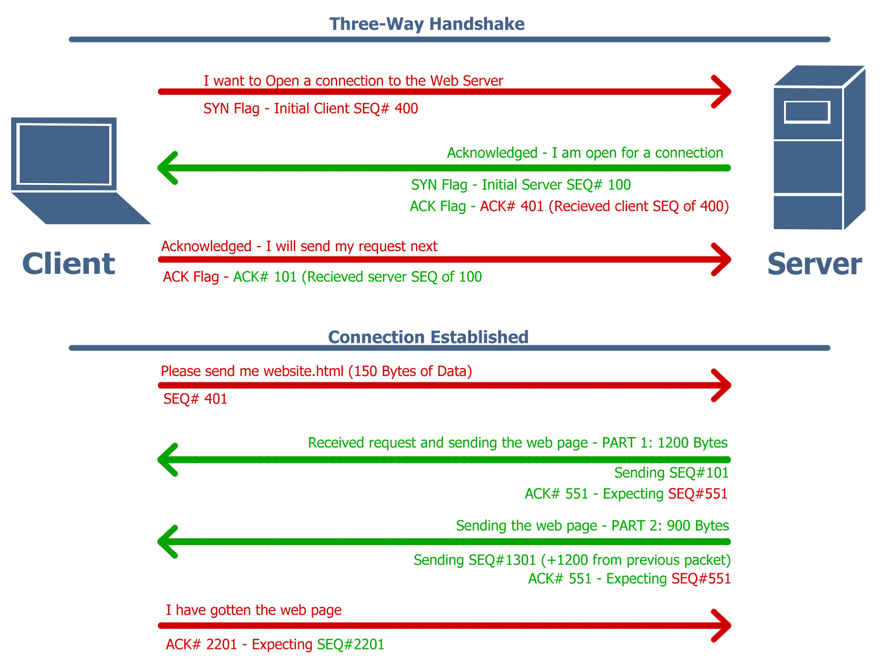
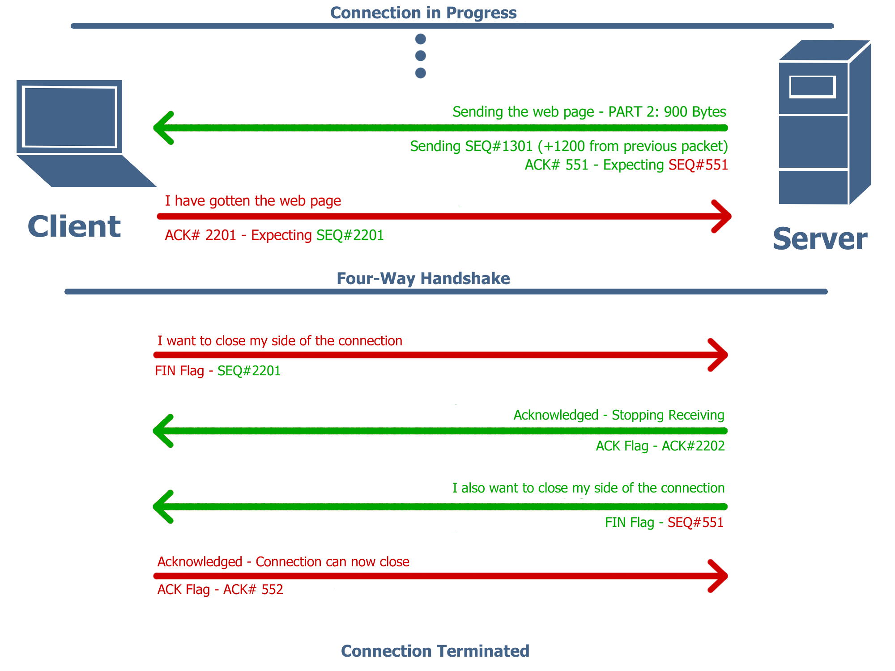

# Transmission Control Protocol (TCP)

## What is TCP
The Transmission Control Protocol (TCP) is the [transport-layer](../OSI%20Model/readme.md) protocol in the TCP/IP stack. First defined in 1974, it builds upon the packet transmission technology of the Internet Protocol to let applications communicate using continuous streams of data, unlike [UDP](../UDP/udp.md) which sends data in discrete packets. Unless the connection dies due to some network problem, TCP guarantees that the data will arrive intact, complete, and in order. 

Most of the Internet uses TCP, including the delivery of web pages to your browser. TCP is also the foundation for protocols that carry long form conversations between people or computers such as SSH terminal sessions and many popular chat protocols. 

## Why TCP?
TCP introduces overhead not present in UDP, but in turn introduces reliability mechanisms, which are required for most network applications to function. TCP ensures this reliable connection through these basic tenets:

- **Every TCP packet is given a sequence number** so that the system on the receiving end can put packets back together in the correct order as well as notice if a packet is missing. When a packet is missing, it can be retransmitted by the sender. 

- **TCP sequence numbers are not sequential (1, 2, 3...) but are based on the next expected byte's position in the overall communication.** A packet of 1024 bytes with a sequence number of 5000 for example, would be followed by a packet with a sequence number of 6024. This means the receiver can recognize the correct sequence number coming next. Additionally, the sender does not need to worry about breaking down data in a particular way. Whether the packet is 128 bytes or 1024, it does not matter, as long as it comes in with the correct sequence number.

- **The initial sequence number for a connection is not set to 0, but is chosen randomly.** This creates additional safety from bad actors who would otherwise be able to send fake packets and disrupt communications.

## TCP Connection Establishment (Three-Way Handshake)
TCP uses a 'three-way handshake' to establish a connection:
1. **Client SYN:** The client sends a synchronization request to start communication.

2. **Server SYN-ACK:** The server acknowledges and sends back its own SYN.

3. **Client ACK:** The client acknowledges the response, completing the setup.

This handshake ensures both ends are ready and that initial sequence numbers are agreed upon. 

## TCP Connection Termination (FIN Four-Way Handshake)
TCP uses a 'four-way handshake' to terminate a connection:

1. **Initiator FIN:** The Initiator sends a request to close the connection. 

2. **Receiver ACK:** The Receiver acknowledges this closing request.

3. **Receiver FIN:** The Receiver sends its agreement to close.

4. **Initiator ACK:** The Initiator acknowledges the Receiver's agreement to close.

This handshake can be initiated by either side of the connection and ensures both parties have received all of the data before allowing the other to close.

## TCP Segment Structure
Each TCP segment consists of a header and a data field. The TCP header contains the following fields:

- **Source Port**: This identifies the sending and receiving applications
- **Sequence Number**: The number establishing relative order in the datastream of the packet
- **Acknowledgement Number**: Indicates the expected SEQ number from the sender
- **Flags**: This refers to the SYN, ACK, FIN, RST, and other identifiers for TCP to interpret data purpose
- **Window Size**: The amount of data the receiver can buffer
- **Checksum**: Detects errors in the segment

*other information can be added to the headers, but these are the most relevant to the core functionality of TCP

## Flow and Congestion Control
### Flow Control
As briefly touched on, TCP uses a sliding window protocol. The receiver advertises a window size (a buffer), and the sender must limit unacknowledged data within this window. This allows data to be sent in bursts, opposed to waiting for an acknowledgement between every packet sent (as seen in the diagram above). This is essential for speed and efficiency of communications, especially when a server is interacting with multiple clients.

### Congestion Control
TCP increases or reduces the sending rate based on network feedback. The basic algorithms used in this include:
- **Slow Start:** Begin with a low throughput and increase it exponentially

- **Congestion Avoidance:** Once a particular throughput is reached, growth rate becomes linear

- **Fast Retransmit:** Quickly resends packets after detecting duplicate ACK numbers

These mechanisms help avoid network collapse and allow the server to throttle individual connections when too many hosts try to send too much data. 

## TCP Checksum
Checksum is a computed number based on the data from a given packet. The sender computes this sum, and adds it to the header of the packet. When the client receives the packet, it makes the same calculation and checks its sum against the one it received. If there is a difference in the number, it indicates that some information in that packet changed during transmission.

TCP checksum calculated by concatenating the pseudo-header (sender IP, reciever IP, protocol, length), TCP header (with checksum set to zero), and the payload (packet data). It then splits this data into 16-bit words, adds them using 1s complement, and takes the 1s complement of the result.