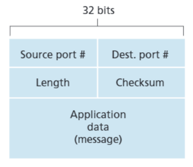

# User Datagram Protocol  (UDP)

### What is UDP?

UDP stands for User Datagram Protocol it takes messages from the application process, attaches source and destination port number fields for the multiplexing/demultiplexing service, adds two other small fields, and passes the resulting segment to the network layer. The network layer encapsulates the transport-layer segment into an IP datagram and then makes a best-effort attempt to deliver the segment to the receiving host. If the segment arrives at the receiving host, UDP uses the destination port number to deliver the segment’s data to the correct application process. Note that with UDP there is no handshaking between sending and receiving transport-layer entities before sending a segment. For this reason, UDP is said to be connectionless.

### Why UDP?

Now you might be wondering why an application developer would ever choose to build an application over UDP rather than over TCP. Isn’t TCP always preferable, since TCP provides a reliable data transfer service, while UDP does not? The answer is no, as some applications are better suited for UDP for the following reasons:

1. **Finer application-level control over what data is sent, and when**. Under UDP, as soon as an application process passes data to UDP, UDP will package the data inside a UDP segment and immediately pass the segment to the network layer. TCP, on the other hand, has a congestion- control mechanism that throttles the transport-layer TCP sender when one or more links between the source and destination hosts become excessively congested. TCP will also continue to resend a segment until the receipt of the segment has been acknowledged by the destination regardless of how long reliable delivery takes. Since real-time applications often require a minimum sending rate, do not want to overly delay segment transmission, and can tolerate some data loss TCP’s service model is not particularly well matched to these applications’ needs. As discussed below, these applications can use UDP and implement, as part of the application, any additional functionality that is needed beyond UDP’s no-frills segment-delivery service.

2. **No connection establishment**. TCP uses a three-way handshake before it starts to transfer data. UDP just blasts away without any formal preliminaries. Thus UDP does not introduce any delay to establish a connection. This is probably the principal reason why DNS runs over UDP rather than TCP—DNS would be much slower if it ran over TCP. HTTP uses TCP rather than UDP, since reliability is critical for Web pages with text.

3. **No connection state**. TCP maintains connection state in the end systems. This connection state includes receive and send buffers, congestion-control parameters, and sequence and acknowledgment number parameters. UDP, on the other hand, does not maintain connection state and does not track any of these parameters. For this reason, a server devoted to a particular application can typically support many more active clients when the application runs over UDP rather than TCP.

4. **Small packet header overhead**. The TCP segment has 20 bytes of header overhead in every segment, whereas UDP has only 8 bytes of overhead.

### UDP Segment Structure

The UDP segment structure, shown in figure above, is defined in RFC 768. The application data occupies the data field of the UDP segment. The UDP header has only four fields, each consisting of two bytes. The port numbers which allow the destination host to pass the application data to the correct process running
on the destination end system (that is, to perform the demultiplexing function). The length field specifies the number of bytes in the UDP segment (header plus data). An explicit length value is needed since the size of the data field may differ from one UDP segment to the next. The checksum is used by the receiving host to check whether errors have been introduced into the segment. In truth, the checksum is also calculated over a few of the fields in the IP header in addition to the UDP segment. The length field specifies the length of the UDP segment, including the header, in bytes.

### What is UDP Checksum and how it is computed?
The UDP checksum provides for error detection. That is, the checksum is used to determine whether bits within the UDP segment have been altered (for example, by noise in the links or while stored in a router) as it moved from source to destination.

UDP at the sender side performs the 1s complement of the sum of all the 16-bit words in the segment, with any overflow encountered during the sum being wrapped around. This result is put in the checksum field of the UDP segment.
